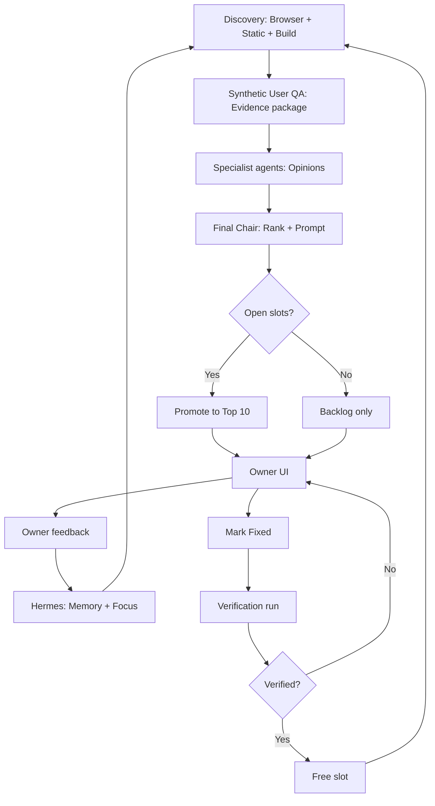

# AgentOps Daily Workflow

## Purpose

Define how scheduled and manual AgentOps runs orchestrate the 12 agents, browser QA, CodeGraph, Hermes memory, queue promotion, and verification—without implementing automation in this phase.

---

## Run Types

| Type | Trigger | Primary goal |
| --- | --- | --- |
| `daily` | Scheduler (future) or Owner habit | Maintain Top 10, quiet backlog growth |
| `manual` | Owner button | On-demand scan with current focus |
| `pre-release` | Before deploy tag | Critical/high sweep, build check |
| `focused` | Focus directive active | Deep pass on module/route set |
| `retest` | Owner or agent request | Re-evaluate specific finding or area |
| `verification` | Mark Fixed / Run verification | Targeted fix confirmation only |

---

## Daily Run Logic

Every daily (or scheduled) run executes:

### Phase 0 — Preconditions

1. Confirm environment (default: `staging` or `local`; production only if `production-read-only`).  
2. **Hermes connection/readiness check** (before daily runs **depend** on Hermes):  
   - Run checklist per `AGENTOPS_HERMES_CONNECTION_CHECKLIST.md` (manual at first).  
   - Record score, label, memory mode, and last check in UI when available.  
   - **If Hermes is unavailable:** continue with **database-only** memory; tag run `memory-limited`; do **not** block critical QA reporting.  
3. Load active **focus directives** from `agentops_focus_directives` (authoritative when Hermes is down).  
4. Load **Hermes memory** when connected (active patterns, rejections, priorities); skip gracefully if unavailable.  
5. Abort promotion if automation lock flag set (future maintenance mode).  

### Phase 1 — Queue accounting

1. Count **active open** findings in Active Top 10 (not Verified Fixed / Rejected / Archived).  
2. Set `active_queue_count_before` and `active_queue_open_slots = 10 - count`.  
3. **If open slots = 0:**  
   - Set `promoted_count = 0` for this run’s promotion phase.  
   - Continue to Phase 2 (quiet scan) and Phase 6 (verification only if pending).  
   - **Do not** promote new Top 10 items.  
4. **If open slots > 0:**  
   - Continue full pipeline; promotion cap = open slots.  

### Phase 2 — Discovery (quiet or full)

| Mode | When |
| --- | --- |
| Full discovery | open slots > 0 OR manual/pre-release |
| Quiet scan | open slots = 0 |

**Discovery sources:**

1. **Static checks** (existing `qa:static-design-guardrails`, `qa:static-discovery`, foundation validation)  
2. **Browser QA** (required for UI/workflow findings—see `AGENTOPS_BROWSER_QA_SPEC.md`)  
3. **Build/lint** (pre-release runs)  
4. **CodeGraph** mapping for each browser/static candidate  

Output: raw **candidate findings** (not yet promoted).

### Phase 3 — Agent collaboration

For each candidate (or batched by route/module):

| Agent | Responsibility |
| --- | --- |
| **Synthetic User QA** | Browser evidence, reproduction steps, screenshots |
| **Design & UX** | Flow clarity, visual hierarchy, responsiveness |
| **Design System & Frontend** | Shared component/CSS vs page drift |
| **Business Logic & Operations** | Finance/company workflow correctness |
| **HR & People Operations** | HR routes and people workflows |
| **Security, Permissions & Tenant** | Role visibility, tenant boundaries, AI limits |
| **Backend, Database & Reliability** | API errors, data integrity, refresh behavior |
| **AI / MCP Architecture** | Tool exposure, agent-ready surfaces |
| **Personal AI Productivity** | User-facing AI UX boundaries |
| **Product & SaaS Strategy** | Commercial readiness, onboarding gaps |
| **Tools & Integrations** | OSS/commercial tool recommendations |
| **Final Council Chair** | Rank, prompt, promotion list, implementation scope |

Each agent records **`agentops_agent_opinions`**. Chair breaks ties.

### Phase 4 — Scoring and ranking

Compute `priority_score` from:

1. Severity band (critical > high > … > improvement)  
2. Focus directive weights (module/category boosts)  
3. Memory penalties (similar rejected / false positive)  
4. Evidence strength (browser > static-only)  
5. `piter_priority_override` if set  
6. Strategic flags (security, tenant, AI boundary)  

Sort candidates descending.

### Phase 5 — Promotion

1. Take top `open_slots` candidates not already active.  
2. Skip duplicates (same route + category + similar title fingerprint).  
3. Assign `top10_rank` 1–10 (fill lowest free ranks).  
4. Set `queue_state = active_top_10`, status `Active Top 10`.  
5. Log `agentops_backlog_promotions`.  
6. Generate **`cursor_prompt`** per finding (Chair).  
7. Remaining candidates → `backlog` with `queue_state = backlog`.  

### Phase 6 — Verification (parallel track)

For findings in `Marked Fixed by Piter` without completed verification:

1. Spawn `verification` run type (may be same orchestration pass).  
2. Execute per `AGENTOPS_FIX_VERIFICATION_SPEC.md`.  
3. Update status and free slots on Verified Fixed.  

### Phase 7 — Persist and surface

1. Write `agentops_runs` summary.  
2. Write findings, evidence, prompts.  
3. Export optional JSON to `qa-agent/reports/agentops-*` (interim).  
4. **UI:** Active Top 10 visible at `/system/agent-ops`.  

---

## Browser QA Requirement

Agents **must not** rely only on static scanning.

Browser QA must:

- Open pages and authenticate as **synthetic roles** (see `qa-agent/registry/synthetic-roles.json`)  
- Click navigation, buttons, tabs  
- Open forms and modals  
- Exercise search / filter / sort on registries  
- Test **safe** draft flows in staging (no production destructive tests)  
- Test archive/restore only in staging with labeled test data  
- Verify role-based visibility (element hidden vs disabled vs error)  
- Test responsive viewports (desktop, tablet minimum)  
- Capture screenshots, console errors, network failures  
- Experience end-to-end user flow and record friction  

Static-only findings must be labeled `evidence_type` including `codegraph-note` or `json` and marked lower confidence unless Chair elevates (e.g. security static signal).

---

## Agent Collaboration Diagram

---

## Memory Use (Hermes)

Agents must use Hermes AgentOps memory to:

- Avoid repeating **rejected** findings  
- Deprioritize **false-positive** patterns  
- Boost **approved** prompt structures  
- Honor **focus directives** and sprint priority  
- Improve prompt precision over time  
- Track **repeated** problems across routes (e.g. same glass pattern on 3 finance hubs)  

See `AGENTOPS_FEEDBACK_MEMORY_SPEC.md`.

---

## CodeGraph Use

Agents must use CodeGraph to:

- `codegraph_search` / `codegraph_context` for route-related symbols  
- `codegraph_trace` for workflow flows  
- `codegraph_impact` before suggesting shared file edits  
- Recommend **shared source-of-truth** vs page-only fix in `recommended_fix_strategy`  

If CodeGraph unavailable: tag finding `codegraph-limited` and lower mapping confidence.

---

## Owner Feedback Loop

After Piter reviews in UI:

1. Persist `agentops_owner_feedback`.  
2. If focus instruction → create/update `agentops_focus_directives`.  
3. Update `agentops_agent_memory` (rejection, approval, false positive).  
4. On next run, apply weights and filters.  
5. UI shows “Adjusted because of your remark on {date}” on related new findings (future).  

---

## Daily Top 10 Balance

Promotion algorithm should balance:

| Factor | Weight |
| --- | --- |
| Critical/high defects | Dominant |
| Current focus directive | Strong |
| Repeated cross-page patterns | Medium-high |
| Approved improvement themes | Medium |
| Easy wins (low effort, clear prompt) | Tie-breaker |
| Strategic SaaS/AI/HR | When slots allow and not ignored by focus |

Never fill all 10 slots with low improvements while critical backlog exists.

---

## Output Artifacts (Every Run)

| Artifact | Location |
| --- | --- |
| Run summary | `agentops_runs.summary` + markdown report |
| Active Top 10 snapshot | UI + JSON export |
| Backlog updates | DB + optional CSV export |
| Full findings archive | DB |
| Prompt suggestions | `agentops_prompt_library` |
| Focus directive changes | audit log |
| Unresolved critical | highlighted in hero |
| Verification results | `agentops_verifications` |
| Retest recommendations | linked findings |

---

## Failure Handling

| Failure | Behavior |
| --- | --- |
| Browser QA down | Static + CodeGraph only; banner “browser-limited” |
| CodeGraph down | Browser + static; tag mappings limited |
| Hermes down | Run without memory; banner “memory-limited” |
| Partial agent timeout | Chair proceeds with available opinions |
| Run crash | `status = failed`; do not corrupt Top 10 ranks |

---

## Schedule Recommendations (Future)

| Schedule | Run type |
| --- | --- |
| Weekdays 06:00 Owner TZ | `daily` |
| On demand | `manual`, `focused` |
| Pre-deploy hook | `pre-release` |
| After Mark Fixed batch | `verification` |

No cron implementation in this spec phase.

---

## Related Documents

- `AGENTOPS_PRODUCT_SPEC.md` — product rules  
- `AGENTOPS_BROWSER_QA_SPEC.md` — browser evidence contract  
- `AGENTOPS_HERMES_CODEGRAPH_SPEC.md` — intelligence layers  
- `AGENTOPS_FIX_VERIFICATION_SPEC.md` — post-fix flow  
