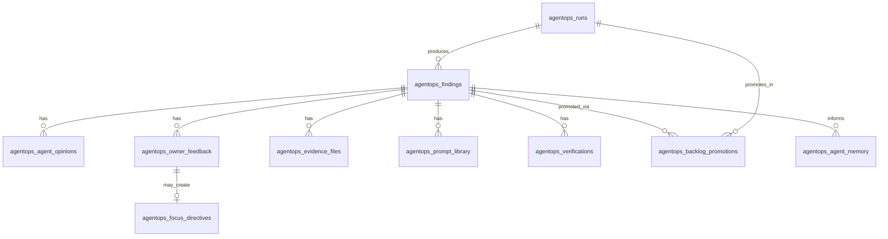

# AgentOps Data Model Specification

## Purpose

Define the **future** database and application data model for the AgentOps dashboard and automation. This document is **specification only**.

**Do not implement SQL, migrations, or Supabase changes until Piter approves this model.**

When implemented later:

- Use Supabase Postgres with **RLS**  
- Default policy: **Owner-only** (`owner_user_id` or platform owner role)  
- Optional future read-only admin views require explicit policy  

---

## Entity Overview

---

## 1. `agentops_runs`

**Purpose:** One record per daily, manual, pre-release, focused, retest, or verification orchestration run.

| Field | Type | Notes |
| --- | --- | --- |
| `id` | uuid | PK |
| `run_type` | enum | `daily` \| `manual` \| `pre-release` \| `focused` \| `retest` \| `verification` |
| `environment` | enum | `local` \| `staging` \| `preview` \| `production-read-only` |
| `started_at` | timestamptz | |
| `finished_at` | timestamptz | nullable while running |
| `status` | enum | `pending` \| `running` \| `completed` \| `failed` \| `partial` \| `cancelled` |
| `triggered_by` | text | `scheduler` \| `owner` \| `verification` \| agent id |
| `focus_directive_snapshot` | jsonb | Active directives at run start |
| `active_queue_count_before` | int | 0–10 |
| `active_queue_open_slots` | int | Slots available for promotion |
| `total_findings` | int | All findings created this run |
| `promoted_count` | int | Moved to Active Top 10 |
| `backlog_count` | int | Added/updated backlog only |
| `verified_fixed_count` | int | Verifications passed |
| `still_broken_count` | int | Verifications failed |
| `summary` | text | Human-readable run summary markdown |

**Indexes:** `started_at`, `run_type`, `status`

---

## 2. `agentops_findings`

**Purpose:** Every issue or improvement produced by agents (active, backlog, or archived).

| Field | Type | Notes |
| --- | --- | --- |
| `id` | uuid | PK |
| `run_id` | uuid | FK → `agentops_runs` (creating run) |
| `issue_code` | text | Stable code e.g. `AOPS-2026-0042` |
| `title` | text | Short headline |
| `category` | enum | Design, Functional, Logical, Technical, Improvement, HR, AI/MCP, Personal AI, SaaS, Security/Permission, Performance/Reliability |
| `severity` | enum | `critical` \| `high` \| `medium` \| `low` \| `improvement` |
| `status` | enum | See lifecycle in `AGENTOPS_PRODUCT_SPEC.md` |
| `queue_state` | enum | `backlog` \| `active_top_10` \| `archived` |
| `top10_rank` | int | 1–10 when active; null otherwise |
| `route` | text | e.g. `/finance/reports` |
| `module` | text | finance, hr, ai-management, system, etc. |
| `page_type` | text | hub, registry, detail, wizard, modal-flow |
| `user_role` | text | Synthetic role used for observation |
| `browser_flow` | text | Step list or flow id |
| `agent_id` | text | Primary reporting combined agent id |
| `review_panel` | text | design-panel, functional-engineering-panel, etc. |
| `evidence_summary` | text | Short evidence abstract |
| `evidence_files` | jsonb | Legacy/quick refs; prefer `agentops_evidence_files` |
| `problem` | text | What is wrong |
| `expected_result` | text | What should happen |
| `actual_result` | text | What happened |
| `likely_root_cause` | text | Hypothesis, not fact |
| `recommended_fix_strategy` | text | shared component vs page vs backend |
| `cursor_prompt` | text | Latest primary prompt |
| `non_change_rules` | text | Explicit must-not-change list |
| `saas_impact` | text | nullable |
| `ai_mcp_impact` | text | nullable |
| `personal_ai_impact` | text | nullable |
| `hr_impact` | text | nullable |
| `security_impact` | text | nullable |
| `priority_score` | numeric | Computed rank |
| `piter_priority_override` | int | nullable manual boost/cut |
| `created_at` | timestamptz | |
| `updated_at` | timestamptz | |

**Indexes:** `queue_state`, `status`, `severity`, `route`, `module`, `top10_rank` (unique where active)

**Constraints:** At most 10 rows with `queue_state = active_top_10` and status not terminal.

---

## 3. `agentops_agent_opinions`

**Purpose:** Per-agent stance on a finding (council deliberation record).

| Field | Type | Notes |
| --- | --- | --- |
| `id` | uuid | PK |
| `finding_id` | uuid | FK |
| `agent_id` | text | Combined agent id |
| `position` | enum | `approve` \| `needs_review` \| `reject` |
| `reason` | text | |
| `suggested_improvement` | text | nullable |
| `blocking_concern` | text | nullable |
| `confidence_score` | numeric | 0–1 |
| `created_at` | timestamptz | |

---

## 4. `agentops_owner_feedback`

**Purpose:** Piter’s remarks, decisions, and fix markers.

| Field | Type | Notes |
| --- | --- | --- |
| `id` | uuid | PK |
| `finding_id` | uuid | FK |
| `owner_user_id` | uuid | FK profiles |
| `feedback_type` | enum | `remark` \| `approve` \| `reject` \| `defer` \| `priority_change` \| `scope_change` \| `false_positive` \| `focus_instruction` \| `mark_fixed` \| `request_retest` \| `mark_in_progress` \| `re_review_request` |
| `remark` | text | |
| `priority_override` | int | nullable |
| `requested_scope` | text | nullable |
| `created_at` | timestamptz | |

---

## 5. `agentops_focus_directives`

**Purpose:** Instructions derived from feedback that steer future runs.

| Field | Type | Notes |
| --- | --- | --- |
| `id` | uuid | PK |
| `source_feedback_id` | uuid | FK nullable |
| `directive_text` | text | Human-readable rule |
| `module_focus` | text[] | e.g. finance |
| `category_focus` | text[] | |
| `agent_focus` | text[] | |
| `route_focus` | text[] | |
| `severity_focus` | text[] | min severity |
| `ignored_areas` | text[] | e.g. hr-future |
| `priority_weight` | jsonb | category/module multipliers |
| `active_from` | timestamptz | |
| `active_until` | timestamptz | nullable |
| `status` | enum | `active` \| `paused` \| `expired` \| `disabled` |
| `created_by` | uuid | owner |
| `created_at` | timestamptz | |

---

## 6. `agentops_agent_memory`

**Purpose:** Long-term AgentOps memory per agent and Owner coordination.

| Field | Type | Notes |
| --- | --- | --- |
| `id` | uuid | PK |
| `agent_id` | text | or `owner-coordinator` |
| `memory_type` | enum | `preference` \| `rejection_pattern` \| `approved_pattern` \| `false_positive_pattern` \| `focus_rule` \| `module_priority` \| `prompt_style` \| `implementation_rule` \| `verification_pattern` |
| `memory_text` | text | |
| `source_finding_id` | uuid | nullable FK |
| `source_feedback_id` | uuid | nullable FK |
| `confidence_score` | numeric | |
| `active` | boolean | |
| `created_at` | timestamptz | |
| `updated_at` | timestamptz | |

---

## 7. `agentops_prompt_library`

**Purpose:** Reusable and historical Cursor/Hermes prompts.

| Field | Type | Notes |
| --- | --- | --- |
| `id` | uuid | PK |
| `finding_id` | uuid | FK |
| `prompt_type` | enum | `fix` \| `improvement` \| `verification` \| `retest` \| `implementation` \| `browser-qa` |
| `prompt_text` | text | |
| `approved_by_owner` | boolean | |
| `copied_by_owner` | boolean | |
| `used_at` | timestamptz | nullable |
| `result_status` | enum | `draft` \| `approved` \| `copied` \| `used` \| `successful` \| `failed` \| `unknown` |
| `created_at` | timestamptz | |

---

## 8. `agentops_evidence_files`

**Purpose:** References to artifacts (paths, URLs, storage keys).

| Field | Type | Notes |
| --- | --- | --- |
| `id` | uuid | PK |
| `finding_id` | uuid | FK |
| `evidence_type` | enum | `screenshot` \| `trace` \| `video` \| `console` \| `network` \| `markdown` \| `json` \| `browser-note` \| `codegraph-note` |
| `file_path` | text | repo-relative or storage URI |
| `summary` | text | |
| `created_at` | timestamptz | |

---

## 9. `agentops_verifications`

**Purpose:** Targeted verification after Mark Fixed.

| Field | Type | Notes |
| --- | --- | --- |
| `id` | uuid | PK |
| `finding_id` | uuid | FK |
| `verification_run_id` | uuid | FK → `agentops_runs` |
| `marked_fixed_feedback_id` | uuid | FK |
| `verification_status` | enum | `verified_fixed` \| `still_broken` \| `needs_follow_up_fix` \| `verification_blocked` |
| `route_retested` | text | |
| `workflow_retested` | text | |
| `expected_fix` | text | |
| `actual_result` | text | |
| `regression_check_summary` | text | |
| `evidence_files` | jsonb | refs to new evidence |
| `follow_up_prompt` | text | nullable |
| `verified_at` | timestamptz | |
| `created_at` | timestamptz | |

---

## 10. `agentops_backlog_promotions`

**Purpose:** Audit trail when backlog (or new scan) fills a Top 10 slot.

| Field | Type | Notes |
| --- | --- | --- |
| `id` | uuid | PK |
| `finding_id` | uuid | FK |
| `run_id` | uuid | FK |
| `promoted_from` | enum | `backlog` \| `new_scan` |
| `promoted_reason` | text | severity, focus, slot number |
| `queue_slot_number` | int | 1–10 |
| `created_at` | timestamptz | |

---

## Data Boundary Rules

| Rule | Requirement |
| --- | --- |
| Default access | Owner-only RLS on all AgentOps tables |
| Personal User AI | No read/write to AgentOps tables or Hermes AgentOps memory |
| Tenant users | No access unless future explicit `agentops_tenant_readonly` policy (off by default) |
| Tenant data in findings | Store minimal PII; redact in evidence; respect tenant isolation in browser tests |
| Production testing | `environment = production-read-only`; no destructive writes |
| Evidence storage | Prefer private bucket or repo `qa-agent/reports/` with Owner access only |

---

## Application Layer Types (Future)

TypeScript types should mirror these entities in `src/lib/agentops/` (future), not in pages.

Queue invariants enforced in service layer:

- `count(active_top_10 where open) <= 10`  
- `promoted_count <= open_slots` per run  
- Verification required before `queue_state` leaves active on fixed items  

---

## Future SQL Notes

1. **Do not implement SQL until Piter approves this data model.**  
2. When approved, create migrations with:  
   - UUID primary keys  
   - `updated_at` triggers  
   - RLS: `auth.uid() = owner_user_id` OR platform owner role claim  
   - No public anon access  
3. Consider soft-delete only for findings (`archived_at`) vs hard delete.  
4. `issue_code` unique constraint.  
5. Partial unique index: one `top10_rank` per rank among active queue.  

---

## JSON Export (Interim)

Until DB exists, runs may write:

- `qa-agent/reports/agentops-run-{id}.json`  
- Mirror structure of tables above for import later  

This keeps current `qa-agent/reports/*` pattern compatible with future Supabase load.
