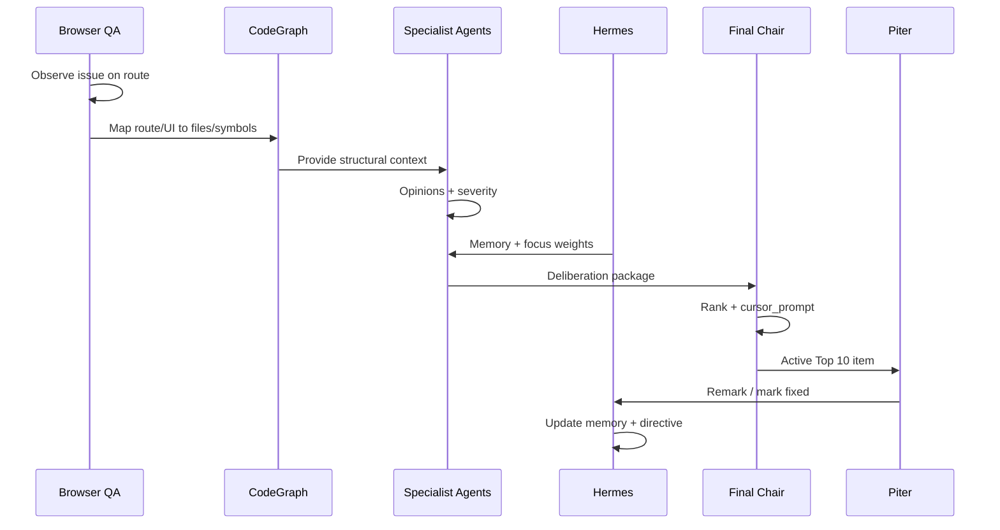

# Hermes and CodeGraph Integration Specification

## Purpose

Define how **Hermes** (memory, planning, coordination) and **CodeGraph** (structural codebase intelligence) support AgentOps alongside browser QA—specification only.

---

## Hermes Role

Hermes acts as the **Owner-only coordination brain** for AgentOps (distinct from tenant Personal AI chat).

### Responsibilities

| Area | Hermes function |
| --- | --- |
| Long-term memory | Persist and retrieve `agentops_agent_memory` patterns |
| Remark interpretation | Parse Piter feedback → focus directives + memory |
| Prioritization | Adjust scores using weights and history |
| Prompt style | Maintain approved prompt templates |
| Agent coordination | Distribute finding batches to specialist agents |
| Repeated issue tracking | Link findings across runs (fingerprints) |
| False-positive learning | Penalize duplicate noise |
| Sprint focus | Time-bound priority narrative for Chair |
| Run planning | Decide quiet vs full scan, module order |
| Explainability | Why item ranked #3 vs #8 |

### Hermes Does Not

- Directly edit code or database  
- Replace Final Council Chair approval authority  
- Expose AgentOps memory to Personal User AI  
- Override Critical security promotion rules without Owner override  

### Hermes Namespaces

| Namespace | Access |
| --- | --- |
| `agentops.owner` | Full AgentOps memory + focus |
| `agentops.run.{runId}` | Ephemeral run context |
| `personal.user.{userId}` | **No access** to AgentOps namespace |
| `tenant.{companyId}` | **No access** by default |

Align with `qa-agent/ai-access-boundary.md` level 7 (Owner AI only) for sensitive coordination data.

---

## CodeGraph Role

CodeGraph is the **AST-backed knowledge graph** for the repo (see `.cursor/rules/codegraph.mdc`).

### Responsibilities

| Area | CodeGraph function |
| --- | --- |
| Codebase search | Find symbols, components, routes |
| Source ownership | Map `src/app/.../page.tsx` to module |
| Route-to-file | Connect `/finance/reports` → page + imports |
| Dependency analysis | `codegraph_impact`, `codegraph_callers` |
| Shared component discovery | `@/components/aixia` usage |
| Repeated pattern discovery | Same Tailwind cluster across files |
| Fix location recommendation | shared CSS vs page vs lib |
| Prompt precision | File paths and symbol names in prompts |

### Preferred Tool Chains (Agents)

| Task | Tool |
| --- | --- |
| Area onboarding | `codegraph_context` |
| Flow understanding | `codegraph_trace` from → to |
| Blast radius | `codegraph_impact` |
| Multi-symbol survey | `codegraph_explore` |
| Single signature | `codegraph_node` |

Agents should **not** grep-first when a structural question suffices.

---

## Browser QA + CodeGraph Flow

Standard pipeline for a browser finding:



### Step detail

1. **Browser QA** finds an issue (e.g. local glass block in modal).  
2. **CodeGraph** maps to `src/app/finance/.../page.tsx`, checks for `AixiaDisplayBlock`, callers, impact.  
3. **Agents** review browser evidence + CodeGraph context; Design System agent flags shared fix.  
4. **Chair** generates prompt: “Replace block with `AixiaDisplayBlock`; inspect `AixiaFormFields.tsx`.”  
5. **Piter** reviews, remarks, marks fixed.  
6. **Hermes** stores false-positive pattern if rejected; focus if “finance-only this week.”  

---

## Mapping Browser Evidence to Code

| Browser signal | CodeGraph follow-up |
| --- | --- |
| Route URL | `codegraph_files` under `src/app` |
| Visible component class | `codegraph_search` for class/component |
| Console stack trace | `codegraph_search` symbol |
| Wrong data shown | trace to Supabase hook / RPC name (read-only in prompt) |
| Permission button visible | trace route guard + permission helpers |

Output fields on finding:

- `recommended_fix_strategy`  
- `codegraph_notes` (evidence file type `codegraph-note`)  
- List of `primary_files[]`  

---

## Memory Boundaries

| Rule | Detail |
| --- | --- |
| Hermes AgentOps memory | Owner-only |
| Personal User AI | Cannot read/write AgentOps memory |
| Tenant users | Cannot access |
| CodeGraph index | Repo-wide read; no tenant data in graph |
| Cross-tenant browser tests | Never use real tenant A data when testing tenant B |

---

## Failure Handling

### Hermes unavailable

| Behavior |
| --- |
| Run proceeds without memory weighting |
| Banner: `memory-limited` on run summary |
| Do not delete or corrupt existing DB memory |
| Chair uses default severity-only ranking |

### CodeGraph unavailable

| Behavior |
| --- |
| Browser QA + static guardrails continue |
| Findings tagged `codegraph-limited` |
| Prompts use route/file paths from static discovery only |
| Lower confidence on “fix shared component first” claims |

### Both unavailable

| Behavior |
| --- |
| Static + manual evidence only |
| Promote only with strong static + Owner pre-approval threshold |
| Critical security static signals may still promote with Chair review |

---

## Hermes ↔ Data Model

| Hermes concept | Table |
| --- | --- |
| Long-term pattern | `agentops_agent_memory` |
| Active focus | `agentops_focus_directives` |
| Feedback source | `agentops_owner_feedback` |
| Run snapshot | `agentops_runs.focus_directive_snapshot` |

Sync direction: DB is source of truth; Hermes cache refreshed per run.

---

## CodeGraph ↔ Evidence

Store CodeGraph excerpts as:

```json
{
  "evidence_type": "codegraph-note",
  "summary": "AixiaDisplayBlock defined in AixiaFormFields.tsx; page uses raw Tailwind instead.",
  "file_path": "qa-agent/reports/agentops-evidence/AOPS-0042-codegraph.md"
}
```

---

## Prompt Generation Standards (Chair + Hermes)

Prompts must include when applicable:

1. Read-first QA docs (`qa-agent/README.md`, council, taxonomy)  
2. CodeGraph-identified files  
3. Browser reproduction steps  
4. **Non-changes** block  
5. Exact block replacement instruction  
6. `npm run build` verification  

Hermes recalls Piter’s preferred prompt ordering from `prompt_style` memory.

---

## Security

- Hermes must not store Supabase service keys or `.env` contents in memory.  
- CodeGraph queries are read-only; agents still must not paste secrets into findings.  
- Owner AI audit log (future) for memory create/delete.  

---

## Hermes Readiness (UI + Gates)

| Requirement | Detail |
| --- | --- |
| **Readiness visible in UI** | AgentOps must show Hermes connection status and **Memory Support Meter** (0–100) per `AGENTOPS_HERMES_READINESS_SPEC.md` |
| **Scored support level** | Memory support level must be scored **0–100** with defined labels |
| **Not assumed connected** | Hermes must **not** be assumed connected until `AGENTOPS_HERMES_CONNECTION_CHECKLIST.md` is passed and Piter approves |
| **Database fallback** | CodeGraph and browser QA continue when Hermes is unavailable; memory-limited runs use DB focus directives only |

---

## Current Discovery Status

**Hermes:** Cursor-only / project-tooling only. **Not app-callable today.**

**CodeGraph:** Cursor MCP / project-tooling only. **Not app-callable today.**

**MVP decision:** AgentOps must use **database-only** memory mode first. Hermes and CodeGraph can support Cursor-side planning and prompt creation, but the **AiXia app cannot rely on them at runtime** yet.

**Initial UI meter (MVP):** Score **8/100**, label **Learning**, mode **Database-only** (see `AGENTOPS_MVP_DECISION_RECORD.md`).

**Future:** A **Hermes/CodeGraph adapter plan** (Stage 9A) is required before live runtime integration in the app or scheduled AgentOps runs.

---

## Related Documents

- `AGENTOPS_FEEDBACK_MEMORY_SPEC.md`  
- `AGENTOPS_HERMES_READINESS_SPEC.md`  
- `AGENTOPS_HERMES_CONNECTION_CHECKLIST.md`  
- `AGENTOPS_HERMES_CONNECTION_DISCOVERY.md`  
- `AGENTOPS_MVP_DECISION_RECORD.md`  
- `AGENTOPS_BROWSER_QA_SPEC.md`  
- `AGENTOPS_FIX_VERIFICATION_SPEC.md`  
- `qa-agent/ai-access-boundary.md`  
