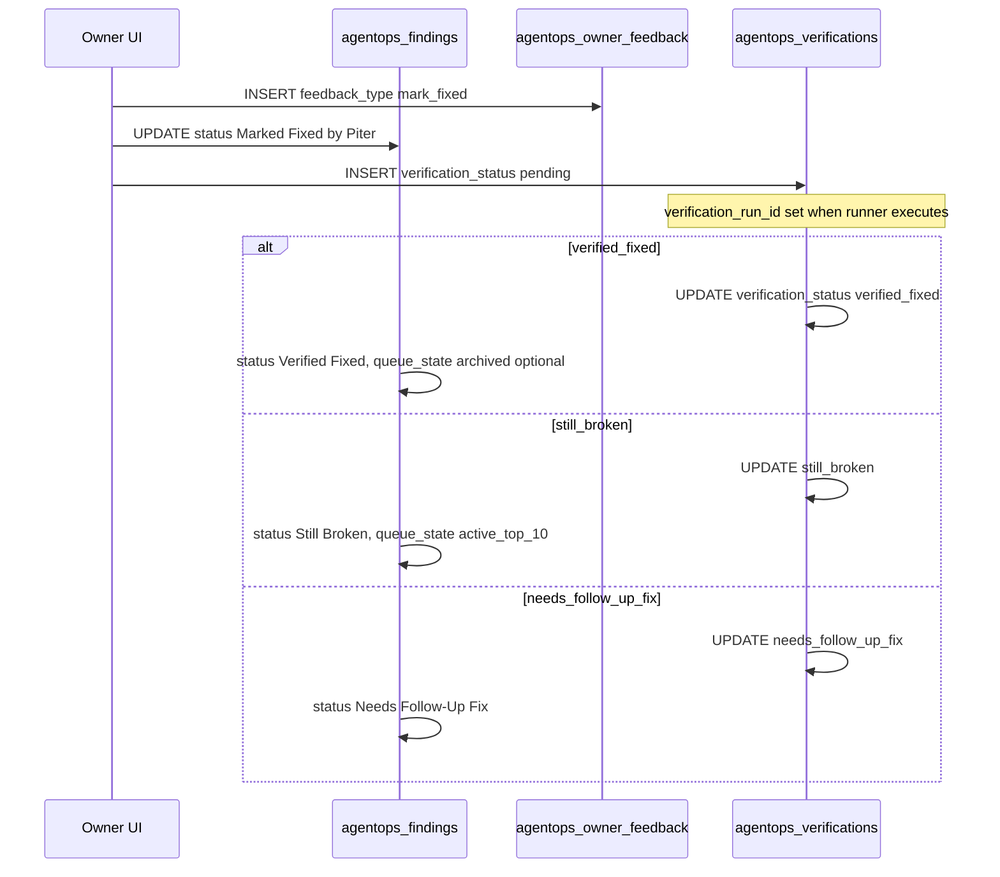

# AgentOps SQL/RLS Implementation Plan

**Version:** 1.0 (plan only)  
**Date:** 2026-05-27  
**Stage:** 2 — documentation before any migration  
**Status:** Awaiting pre-SQL schema inspection (Stage 2 pre-step) and explicit Piter approval for Stage 2B (apply migration)

---

## Purpose

This document plans the **Supabase/Postgres** implementation for the **AgentOps MVP**. It defines tables, columns, constraints, indexes, RLS strategy, migration order, validation, and rollback—**without creating SQL files or applying migrations**.

**Related:** `AGENTOPS_DATA_MODEL_SPEC.md`, `AGENTOPS_DATA_MODEL_APPROVAL_CHECKLIST.md`, `AGENTOPS_MVP_DECISION_RECORD.md`, `AGENTOPS_IMPLEMENTATION_SEQUENCE.md`

---

## MVP Decision Summary

| Decision | Value |
| --- | --- |
| Memory mode | **Database-only** |
| Hermes score (initial UI) | **8 / 100** |
| Hermes label | **Learning** |
| Hermes app-callable | **No** |
| CodeGraph app-callable | **No** |
| AgentOps access | **Owner-only by default** |
| Personal User AI | **Cannot** access AgentOps memory/tables |
| Tenant users | **Cannot** access global AgentOps data |
| Production browser runs | **Read-only only** (`production-read-only` environment) |
| Hermes live automation | **Out of scope** for this migration |

---

## Implementation Scope

### This plan covers

- AgentOps database tables (10 entities)  
- Columns, recommended Postgres types, defaults  
- Foreign keys, check constraints, indexes  
- RLS strategy and owner-only access model  
- Helper function / RPC **planning** (not implementation)  
- Migration order, validation queries, rollback considerations  
- Hermes readiness snapshot storage in run metadata (no separate Hermes service table in MVP)

### This plan does NOT cover

- UI (`/system/agent-ops`)  
- API routes, Edge Functions, service layer TypeScript  
- Browser QA runner, cron/scheduler  
- Hermes live integration, CodeGraph live integration  
- Personal AI access to AgentOps  
- Applying migrations to Supabase (Stage **2B**)

---

## Section 1 — Required Tables

| # | Table | MVP required | Purpose (summary) |
| --- | --- | --- | --- |
| 1 | `agentops_runs` | **Yes** | Orchestration run audit and slot accounting |
| 2 | `agentops_findings` | **Yes** | Issues/improvements; Active Top 10 + backlog |
| 3 | `agentops_agent_opinions` | **Yes** | Council positions per finding |
| 4 | `agentops_owner_feedback` | **Yes** | Piter remarks and state changes |
| 5 | `agentops_focus_directives` | **Yes** | DB focus rules for future runs |
| 6 | `agentops_agent_memory` | **Yes** (schema); **light use** | Long-term patterns; primary store until Hermes adapter |
| 7 | `agentops_prompt_library` | **Yes** | Versioned Cursor/Hermes prompts |
| 8 | `agentops_evidence_files` | **Yes** | Screenshots, logs, codegraph-note paths |
| 9 | `agentops_verifications` | **Yes** | Post–mark-fixed verification |
| 10 | `agentops_backlog_promotions` | **Yes** | Audit trail for Top 10 promotions |

---

## Section 2 — Proposed Table Details

**Convention notes (apply at SQL time after inspection):**

- Schema: **`public`** unless inspection shows a dedicated schema pattern.  
- IDs: **`gen_random_uuid()`** if project already uses it (common on Supabase).  
- Enums: **text + `CHECK`** for MVP flexibility (see Section 12).  
- `triggered_by` on runs: **uuid** nullable → `auth.users` or `profiles.user_id` (differs from older spec text field; prefer uuid for audit).  
- `updated_at`: reuse **`public.finance_set_updated_at()`** trigger if that is the project standard (seen on `ai_settings`, task tables).

---

### 1. `agentops_runs`

| Attribute | Detail |
| --- | --- |
| **Purpose** | One row per daily, manual, pre-release, focused, retest, verification, or import orchestration run |
| **MVP required** | **Yes** |

| Column | Type | Required | Default | Notes |
| --- | --- | --- | --- | --- |
| `id` | `uuid` | Yes | `gen_random_uuid()` | PK |
| `run_type` | `text` | Yes | — | CHECK below |
| `environment` | `text` | Yes | — | CHECK below |
| `started_at` | `timestamptz` | Yes | `now()` | |
| `finished_at` | `timestamptz` | No | `null` | |
| `status` | `text` | Yes | `'pending'` | CHECK below |
| `triggered_by` | `uuid` | No | `null` | FK → `profiles.user_id` or `auth.users` after inspection |
| `focus_directive_snapshot` | `jsonb` | Yes | `'{}'` | Active directives at run start |
| `active_queue_count_before` | `integer` | Yes | `0` | 0–10 |
| `active_queue_open_slots` | `integer` | Yes | `0` | 0–10 |
| `total_findings` | `integer` | Yes | `0` | |
| `promoted_count` | `integer` | Yes | `0` | |
| `backlog_count` | `integer` | Yes | `0` | |
| `verified_fixed_count` | `integer` | Yes | `0` | |
| `still_broken_count` | `integer` | Yes | `0` | |
| `summary` | `text` | No | `null` | Markdown summary |
| `metadata` | `jsonb` | Yes | `'{}'` | Hermes readiness snapshot (Section 6) |
| `created_at` | `timestamptz` | Yes | `now()` | |
| `updated_at` | `timestamptz` | Yes | `now()` | Trigger |

**Check constraints:**

- `run_type` ∈ `('daily','manual','pre-release','focused','retest','verification','import')`  
- `environment` ∈ `('local','staging','preview','production-read-only')`  
- `status` ∈ `('pending','running','completed','failed','cancelled')`  
- Optional: `active_queue_count_before` BETWEEN 0 AND 10; same for `active_queue_open_slots`

**Foreign keys:** `triggered_by` → profile/user (TBD after inspection)

**Indexes:** `status`, `run_type`, `started_at DESC`, `created_at DESC`

**RLS:** Owner-only `SELECT`/`INSERT`/`UPDATE`; optional service-role insert for future runner (separate policy, off until approved)

**Notes:** Align `status` with product spec (`partial` vs `failed`) at SQL time—MVP checklist uses `failed` only.

---

### 2. `agentops_findings`

| Attribute | Detail |
| --- | --- |
| **Purpose** | Every issue/improvement; Active Top 10, backlog, archived |
| **MVP required** | **Yes** |

| Column | Type | Required | Default | Notes |
| --- | --- | --- | --- | --- |
| `id` | `uuid` | Yes | `gen_random_uuid()` | PK |
| `run_id` | `uuid` | No | `null` | FK → `agentops_runs(id)` ON DELETE SET NULL |
| `issue_code` | `text` | Yes | — | UNIQUE, e.g. `AOPS-2026-0042` |
| `title` | `text` | Yes | — | |
| `category` | `text` | Yes | — | CHECK below |
| `severity` | `text` | Yes | — | CHECK below |
| `status` | `text` | Yes | `'New'` | CHECK below |
| `queue_state` | `text` | Yes | `'backlog'` | CHECK below |
| `top10_rank` | `integer` | No | `null` | 1–10 when active |
| `route` | `text` | No | `null` | |
| `module` | `text` | No | `null` | |
| `page_type` | `text` | No | `null` | |
| `user_role` | `text` | No | `null` | Synthetic QA role |
| `browser_flow` | `text` | No | `null` | |
| `agent_id` | `text` | No | `null` | Combined agent id |
| `review_panel` | `text` | No | `null` | |
| `evidence_summary` | `text` | No | `null` | |
| `evidence_files` | `jsonb` | Yes | `'[]'` | Quick refs; prefer `agentops_evidence_files` |
| `problem` | `text` | Yes | — | |
| `expected_result` | `text` | No | `null` | |
| `actual_result` | `text` | No | `null` | |
| `likely_root_cause` | `text` | No | `null` | |
| `recommended_fix_strategy` | `text` | No | `null` | |
| `cursor_prompt` | `text` | No | `null` | Latest primary prompt |
| `non_change_rules` | `text` | No | `null` | |
| `saas_impact` | `text` | No | `null` | |
| `ai_mcp_impact` | `text` | No | `null` | |
| `personal_ai_impact` | `text` | No | `null` | |
| `hr_impact` | `text` | No | `null` | |
| `security_impact` | `text` | No | `null` | |
| `priority_score` | `numeric` | Yes | `0` | Ranking |
| `piter_priority_override` | `numeric` | No | `null` | 0–100 if set |
| `metadata` | `jsonb` | Yes | `'{}'` | |
| `created_at` | `timestamptz` | Yes | `now()` | |
| `updated_at` | `timestamptz` | Yes | `now()` | Trigger |

**Check constraints:**

- `category` ∈ `('Design','Functional','Logical','Technical','Improvement','HR','AI/MCP','Personal AI','SaaS','Security/Permission','Performance/Reliability')`  
- `severity` ∈ `('Critical','High','Medium','Low','Suggestion')`  
- `status` ∈ `('New','Backlog','Active Top 10','Owner Reviewed','Approved for Fix','Rejected','Deferred','False Positive','In Progress','Marked Fixed by Piter','Verification Running','Verified Fixed','Still Broken','Needs Follow-Up Fix','Verification Blocked','Archived')`  
- `queue_state` ∈ `('backlog','active_top_10','archived')`  
- `top10_rank` IS NULL OR (`top10_rank` BETWEEN 1 AND 10)  
- When `queue_state = 'active_top_10'`, `top10_rank` should NOT NULL (enforce in RPC/service)

**Foreign keys:** `run_id` → `agentops_runs(id)` ON DELETE SET NULL

**Indexes:**

- `(queue_state, status)`  
- `severity`, `category`, `module`, `route`  
- `priority_score DESC`  
- `top10_rank` (partial unique below)  
- `created_at DESC`  
- `run_id`  
- **Partial unique:** `UNIQUE (top10_rank) WHERE queue_state = 'active_top_10' AND status NOT IN (closed statuses)` — see Section 4

**RLS:** Owner-only all operations

**Queue rule:** Max **10** open `active_top_10` items — **not** fully enforceable with CHECK alone. **Recommend:** RPC `agentops_promote_findings_to_active(p_limit integer)` + service recheck (Section 4).

---

### 3. `agentops_agent_opinions`

| Attribute | Detail |
| --- | --- |
| **Purpose** | Per-agent council position on a finding |
| **MVP required** | **Yes** |

| Column | Type | Required | Default |
| --- | --- | --- | --- |
| `id` | `uuid` | Yes | `gen_random_uuid()` |
| `finding_id` | `uuid` | Yes | — |
| `agent_id` | `text` | Yes | — |
| `position` | `text` | Yes | — |
| `reason` | `text` | Yes | — |
| `suggested_improvement` | `text` | No | `null` |
| `blocking_concern` | `text` | No | `null` |
| `confidence_score` | `numeric` | No | `null` |
| `created_at` | `timestamptz` | Yes | `now()` |

**Checks:** `position` ∈ `('approve','needs_review','reject')`; `confidence_score` NULL OR BETWEEN 0 AND 100

**FK:** `finding_id` → `agentops_findings(id)` ON DELETE CASCADE

**Indexes:** `finding_id`, `agent_id`, `position`

**RLS:** Owner-only

---

### 4. `agentops_owner_feedback`

| Attribute | Detail |
| --- | --- |
| **Purpose** | Piter remarks, approvals, mark fixed, focus instructions |
| **MVP required** | **Yes** |

| Column | Type | Required | Default |
| --- | --- | --- | --- |
| `id` | `uuid` | Yes | `gen_random_uuid()` |
| `finding_id` | `uuid` | No | `null` |
| `owner_user_id` | `uuid` | Yes | — |
| `feedback_type` | `text` | Yes | — |
| `remark` | `text` | No | `null` |
| `priority_override` | `numeric` | No | `null` |
| `requested_scope` | `text` | No | `null` |
| `metadata` | `jsonb` | Yes | `'{}'` |
| `created_at` | `timestamptz` | Yes | `now()` |

**Checks:**

- `feedback_type` ∈ `('remark','approve','reject','defer','priority_change','scope_change','false_positive','focus_instruction','mark_in_progress','mark_fixed','request_verification','re_review_request')`  
- `priority_override` NULL OR BETWEEN 0 AND 100

**FK:** `finding_id` → `agentops_findings(id)` ON DELETE CASCADE; `owner_user_id` → `profiles.user_id` (TBD)

**Indexes:** `finding_id`, `owner_user_id`, `feedback_type`, `created_at DESC`

**RLS:** Owner-only; `INSERT` must set `owner_user_id = auth.uid()` (or owner helper)

---

### 5. `agentops_focus_directives`

| Attribute | Detail |
| --- | --- |
| **Purpose** | DB-stored focus rules (MVP primary memory for run steering) |
| **MVP required** | **Yes** |

| Column | Type | Required | Default |
| --- | --- | --- | --- |
| `id` | `uuid` | Yes | `gen_random_uuid()` |
| `source_feedback_id` | `uuid` | No | `null` |
| `directive_text` | `text` | Yes | — |
| `module_focus` | `text` | No | `null` |
| `category_focus` | `text` | No | `null` |
| `agent_focus` | `text` | No | `null` |
| `route_focus` | `text` | No | `null` |
| `severity_focus` | `text` | No | `null` |
| `ignored_areas` | `jsonb` | Yes | `'[]'` |
| `priority_weight` | `numeric` | Yes | `1` |
| `active_from` | `timestamptz` | Yes | `now()` |
| `active_until` | `timestamptz` | No | `null` |
| `status` | `text` | Yes | `'active'` |
| `created_by` | `uuid` | No | `null` |
| `metadata` | `jsonb` | Yes | `'{}'` |
| `created_at` | `timestamptz` | Yes | `now()` |
| `updated_at` | `timestamptz` | Yes | `now()` |

**Checks:** `status` ∈ `('active','paused','expired','deleted')`; `priority_weight` BETWEEN 0 AND 10

**FK:** `source_feedback_id` → `agentops_owner_feedback(id)` ON DELETE SET NULL

**Indexes:** `status`, `active_from`, `active_until`, `module_focus`, `category_focus`

**RLS:** Owner-only

---

### 6. `agentops_agent_memory`

| Attribute | Detail |
| --- | --- |
| **Purpose** | Long-term patterns (false positive, prompt style, etc.) |
| **MVP required** | **Yes** (table); **light** row volume until Hermes adapter |

| Column | Type | Required | Default |
| --- | --- | --- | --- |
| `id` | `uuid` | Yes | `gen_random_uuid()` |
| `agent_id` | `text` | Yes | — |
| `memory_type` | `text` | Yes | — |
| `memory_text` | `text` | Yes | — |
| `source_finding_id` | `uuid` | No | `null` |
| `source_feedback_id` | `uuid` | No | `null` |
| `confidence_score` | `numeric` | No | `null` |
| `active` | `boolean` | Yes | `true` |
| `metadata` | `jsonb` | Yes | `'{}'` |
| `created_at` | `timestamptz` | Yes | `now()` |
| `updated_at` | `timestamptz` | Yes | `now()` |

**Checks:**

- `memory_type` ∈ `('preference','rejection_pattern','approved_pattern','false_positive_pattern','focus_rule','module_priority','prompt_style','implementation_rule','verification_pattern')`  
- `confidence_score` NULL OR BETWEEN 0 AND 100

**FK:** optional links to findings / feedback ON DELETE SET NULL

**Indexes:** `agent_id`, `memory_type`, `active`, `created_at DESC`

**RLS:** Owner-only — **must not** be exposed to Personal User AI views

**Note:** MVP writes via Owner UI or import scripts; not Hermes automation.

---

### 7. `agentops_prompt_library`

| Attribute | Detail |
| --- | --- |
| **Purpose** | Versioned Cursor/Hermes prompts per finding |
| **MVP required** | **Yes** |

| Column | Type | Required | Default |
| --- | --- | --- | --- |
| `id` | `uuid` | Yes | `gen_random_uuid()` |
| `finding_id` | `uuid` | No | `null` |
| `prompt_type` | `text` | Yes | — |
| `prompt_text` | `text` | Yes | — |
| `approved_by_owner` | `boolean` | Yes | `false` |
| `copied_by_owner` | `boolean` | Yes | `false` |
| `used_at` | `timestamptz` | No | `null` |
| `result_status` | `text` | No | `null` |
| `metadata` | `jsonb` | Yes | `'{}'` |
| `created_at` | `timestamptz` | Yes | `now()` |
| `updated_at` | `timestamptz` | Yes | `now()` |

**Checks:**

- `prompt_type` ∈ `('fix','improvement','verification','retest','implementation','browser-qa')`  
- `result_status` IS NULL OR ∈ `('draft','approved','copied','used','successful','failed','obsolete')`

**FK:** `finding_id` → `agentops_findings(id)` ON DELETE CASCADE

**Indexes:** `finding_id`, `prompt_type`, `approved_by_owner`, `created_at DESC`

**RLS:** Owner-only

---

### 8. `agentops_evidence_files`

| Attribute | Detail |
| --- | --- |
| **Purpose** | File paths / report refs for browser, static, CodeGraph notes |
| **MVP required** | **Yes** |

| Column | Type | Required | Default |
| --- | --- | --- | --- |
| `id` | `uuid` | Yes | `gen_random_uuid()` |
| `finding_id` | `uuid` | No | `null` |
| `verification_id` | `uuid` | No | `null` |
| `evidence_type` | `text` | Yes | — |
| `file_path` | `text` | Yes | — |
| `summary` | `text` | No | `null` |
| `metadata` | `jsonb` | Yes | `'{}'` |
| `created_at` | `timestamptz` | Yes | `now()` |

**Checks:** `evidence_type` ∈ `('screenshot','trace','video','console','network','markdown','json','browser-note','codegraph-note')`

**FK:**

- `finding_id` → `agentops_findings(id)` ON DELETE CASCADE  
- `verification_id` → `agentops_verifications(id)` ON DELETE CASCADE — add in migration **after** verifications table exists (or defer FK to follow-up migration)

**Indexes:** `finding_id`, `evidence_type`, `created_at DESC`

**RLS:** Owner-only

**Note:** MVP uses **repo paths** first; Supabase Storage URLs later.

---

### 9. `agentops_verifications`

| Attribute | Detail |
| --- | --- |
| **Purpose** | Targeted retest after Mark Fixed |
| **MVP required** | **Yes** |

| Column | Type | Required | Default |
| --- | --- | --- | --- |
| `id` | `uuid` | Yes | `gen_random_uuid()` |
| `finding_id` | `uuid` | Yes | — |
| `verification_run_id` | `uuid` | No | `null` |
| `marked_fixed_feedback_id` | `uuid` | No | `null` |
| `verification_status` | `text` | Yes | `'pending'` |
| `route_retested` | `text` | No | `null` |
| `workflow_retested` | `text` | No | `null` |
| `expected_fix` | `text` | No | `null` |
| `actual_result` | `text` | No | `null` |
| `regression_check_summary` | `text` | No | `null` |
| `evidence_files` | `jsonb` | Yes | `'[]'` |
| `follow_up_prompt` | `text` | No | `null` |
| `verified_at` | `timestamptz` | No | `null` |
| `metadata` | `jsonb` | Yes | `'{}'` |
| `created_at` | `timestamptz` | Yes | `now()` |
| `updated_at` | `timestamptz` | Yes | `now()` |

**Checks:** `verification_status` ∈ `('pending','running','verified_fixed','still_broken','needs_follow_up_fix','verification_blocked','cancelled')`

**FK:**

- `finding_id` → `agentops_findings(id)` ON DELETE CASCADE  
- `verification_run_id` → `agentops_runs(id)` ON DELETE SET NULL  
- `marked_fixed_feedback_id` → `agentops_owner_feedback(id)` ON DELETE SET NULL  

**Indexes:** `finding_id`, `verification_status`, `verified_at DESC`, `created_at DESC`

**RLS:** Owner-only

---

### 10. `agentops_backlog_promotions`

| Attribute | Detail |
| --- | --- |
| **Purpose** | Audit when a finding enters Active Top 10 |
| **MVP required** | **Yes** |

| Column | Type | Required | Default |
| --- | --- | --- | --- |
| `id` | `uuid` | Yes | `gen_random_uuid()` |
| `finding_id` | `uuid` | Yes | — |
| `run_id` | `uuid` | No | `null` |
| `promoted_from` | `text` | Yes | — |
| `promoted_reason` | `text` | Yes | — |
| `queue_slot_number` | `integer` | Yes | — |
| `created_at` | `timestamptz` | Yes | `now()` |

**Checks:** `promoted_from` ∈ `('backlog','new_scan','manual')`; `queue_slot_number` BETWEEN 1 AND 10

**FK:** `finding_id` → `agentops_findings(id)` ON DELETE CASCADE; `run_id` → `agentops_runs(id)` ON DELETE SET NULL

**Indexes:** `finding_id`, `run_id`, `queue_slot_number`, `created_at DESC`

**RLS:** Owner-only

---

## Section 3 — RLS Strategy

### Principles

1. **Enable RLS** on every `agentops_*` table.  
2. **Authenticated only** — no `anon` policies.  
3. **Default deny** — no broad `authenticated` read.  
4. **Owner/platform-admin only** for MVP (exact predicate TBD).  
5. **No** normal employee, finance user, or tenant admin access unless a **future named policy** is explicitly approved.  
6. **No** Personal User AI path — do not add AgentOps tables to shared AI-readable views.  
7. **No** tenant-scoped global reads — AgentOps is platform-owner global QA, not per-tenant product data.  
8. **Service runner** (optional later): separate `INSERT`-only policy using `service_role` or a signed JWT claim — **not** in MVP migration unless Piter approves.

### Do not guess the role system

Before writing SQL, **inspect** existing auth/profile/role tables and permission helpers.

**Likely candidates (from existing migrations — verify):**

| Asset | Observation |
| --- | --- |
| `public.profiles` | `user_id`, `role` — analytics RLS uses `lower(trim(p.role::text)) = 'admin'` |
| `src/lib/permissions.ts` | App roles: `admin`, `manager`, `employee`, `guest` |
| `public.finance_user_has_permission(...)` | Finance-specific; **not** AgentOps |
| `public.finance_get_effective_permissions(auth.uid())` | Finance JSON permissions |

**AgentOps owner check options (pick one after inspection):**

| Option | Description |
| --- | --- |
| A | `public.agentops_is_owner()` — new `SECURITY DEFINER` helper wrapping approved predicate |
| B | Reuse **admin-only** pattern from `app_analytics_*` if Piter confirms all AgentOps users are `profiles.role = 'admin'` |
| C | Dedicated `profiles` flag / allowlist table for platform owner user id(s) |

**Do not assume final helper name** until Stage 2 pre-inspection completes.

### Planned policy shape (per table)

For each `agentops_*` table:

| Operation | Policy intent |
| --- | --- |
| `SELECT` | `agentops_is_owner()` OR approved owner predicate |
| `INSERT` | Same + `owner_user_id = auth.uid()` where applicable |
| `UPDATE` | Same |
| `DELETE` | Same (or disallow hard delete; prefer `status`/`archived`) |

**Grants:** `GRANT SELECT, INSERT, UPDATE, DELETE` to `authenticated` only where policies exist; **no** grants to `anon`.

**Future admin read-only:** separate policy name, **disabled** in MVP migration.

---

## Section 4 — Active Top 10 Queue Enforcement Plan

### Definitions

**Active queue item:** `queue_state = 'active_top_10'` AND `status` NOT IN **closed statuses**.

**Closed statuses** (free slot / not counting toward cap):

- `Verified Fixed`  
- `Rejected`  
- `Deferred`  
- `False Positive`  
- `Archived`  

**Open statuses** (count toward active cap when `queue_state = 'active_top_10'`):

- `New`, `Active Top 10`, `Owner Reviewed`, `Approved for Fix`, `In Progress`  
- `Marked Fixed by Piter`, `Verification Running`  
- `Still Broken`, `Needs Follow-Up Fix`, `Verification Blocked`  

### Rules (application + DB)

| Rule | Enforcement |
| --- | --- |
| Max **10** open active Top 10 items | Service layer + optional RPC + partial unique index on `top10_rank` |
| Queue full → **no promotion** | Run sets `promoted_count = 0` |
| **N** verified fixed → promote at most **N** | Daily workflow / RPC `p_limit` |
| **Mark Fixed** does not close | Status → `Marked Fixed by Piter`; stays active |
| **Mark Fixed** creates verification | Row in `agentops_verifications` (`pending`) |
| **Verified Fixed** frees slot | Status + optional `queue_state` → `archived` per UI policy |
| **Still Broken** stays active | `queue_state` remains `active_top_10` |
| Critical/High/Medium before improvements | Application ranking in service layer |

### Recommended approach

**Phase MVP migration:**

1. **Partial unique index** on `top10_rank` for active rows (prevents duplicate ranks).  
2. **Service-layer** promotion with transaction + `SELECT COUNT(*)` guard.  
3. **Stage 3 / follow-up migration:** RPC  
   `agentops_promote_findings_to_active(p_limit integer)`  
   - Locks or serializes promotion  
   - Selects top backlog by priority  
   - Sets `queue_state`, `top10_rank`, inserts `agentops_backlog_promotions`  
   - Returns promoted count  

**Do not create RPC in Stage 2B** unless Piter explicitly requests it in the SQL prompt.

---

## Section 5 — Verification Flow Plan

When Piter **marks fixed** (application/service layer; documented for SQL consumers):



| Step | Action |
| --- | --- |
| 1 | `INSERT agentops_owner_feedback` (`feedback_type = 'mark_fixed'`) |
| 2 | `UPDATE agentops_findings` → `status = 'Marked Fixed by Piter'` |
| 3 | `INSERT agentops_verifications` → `verification_status = 'pending'` |
| 4 | Verification runner (later) → `running` → result status |
| 5a | `verified_fixed` → finding `Verified Fixed`; slot available |
| 5b | `still_broken` → finding `Still Broken`; remains in Top 10 |
| 5c | `needs_follow_up_fix` → optional linked finding later |

**DB does not auto-trigger** these steps in MVP—implement in service layer or future RPC.

---

## Section 6 — Hermes Readiness Fields Plan

Hermes is **database-only** / **Cursor-only** for MVP. **No** `agentops_system_status` table in initial migration.

### Recommendation: `agentops_runs.metadata`

Store snapshot on each run (and optionally copy latest to UI from most recent run):

```json
{
  "hermes": {
    "score": 8,
    "label": "Learning",
    "mode": "Database-only",
    "appCallable": false,
    "codegraphCallable": false,
    "checkedAt": "2026-05-27T00:00:00.000Z"
  }
}
```

### Future options (not MVP migration)

| Option | When |
| --- | --- |
| `agentops_system_status` table | When UI needs current meter without a run |
| Computed view | Latest run metadata |
| Stage 9A adapter | Automated score updates |

---

## Section 7 — Index Plan

| Use case | Recommended index |
| --- | --- |
| Current active queue | `agentops_findings (queue_state, status)` WHERE partial optional |
| Backlog by priority | `agentops_findings (queue_state, priority_score DESC)` WHERE `queue_state = 'backlog'` |
| Findings by status/severity/category | Individual + composite as listed per table |
| Run history | `agentops_runs (started_at DESC)` |
| Owner feedback by finding | `agentops_owner_feedback (finding_id, created_at DESC)` |
| Active focus directives | `agentops_focus_directives (status, active_from)` WHERE `status = 'active'` |
| Active memory | `agentops_agent_memory (active, memory_type)` WHERE `active = true` |
| Verification pending | `agentops_verifications (verification_status)` WHERE `verification_status IN ('pending','running')` |
| Top 10 rank uniqueness | Partial unique on `top10_rank` for active open rows |

---

## Section 8 — Migration Order

| Step | Action |
| --- | --- |
| 1 | Confirm `gen_random_uuid()` / `pgcrypto` availability (Supabase default) |
| 2 | **Pre-SQL inspection** (Section 9) — profiles, helpers, triggers |
| 3 | Create `agentops_is_owner()` (or approved equivalent) — **after** inspection |
| 4 | `agentops_runs` |
| 5 | `agentops_findings` |
| 6 | `agentops_agent_opinions` |
| 7 | `agentops_owner_feedback` |
| 8 | `agentops_focus_directives` |
| 9 | `agentops_agent_memory` |
| 10 | `agentops_prompt_library` |
| 11 | `agentops_verifications` |
| 12 | `agentops_evidence_files` (+ FK `verification_id` if not deferred) |
| 13 | `agentops_backlog_promotions` |
| 14 | Secondary indexes + partial unique index for Top 10 |
| 15 | `updated_at` triggers on tables with `updated_at` |
| 16 | `ENABLE ROW LEVEL SECURITY` on all tables |
| 17 | Owner policies (`SELECT`/`INSERT`/`UPDATE`/`DELETE`) |
| 18 | `GRANT` to `authenticated` as needed |
| 19 | Optional seed data — **only** after Piter approves |

**Suggested migration file name (when approved):**  
`supabase/migrations/YYYYMMDDHHMMSS_agentops_owner_tables_rls.sql`

---

## Section 9 — Pre-SQL Schema Inspection Required

**Do not write migration SQL** until inspection results are recorded (separate prompt: **Stage 2 pre-step / Prompt 14E**).

### Inspect

| Item | Why |
| --- | --- |
| Profile/user table names | RLS `auth.uid()` join |
| Owner/admin role values | `agentops_is_owner()` predicate |
| Existing RLS helper functions | Reuse vs new |
| `updated_at` trigger pattern | `finance_set_updated_at()` vs other |
| UUID defaults | `gen_random_uuid()` |
| Schema naming | `public` only? |
| Audit columns | `created_by`, `updated_by` conventions |
| Tenant/company columns | Ensure AgentOps tables stay global |

### Inspection queries (run later on staging — not executed in this plan)

```sql
-- Profile / user tables
SELECT table_schema, table_name
FROM information_schema.tables
WHERE table_schema = 'public'
  AND (table_name ILIKE '%profile%' OR table_name ILIKE '%user%')
ORDER BY table_name;

-- profiles columns
SELECT column_name, data_type, is_nullable
FROM information_schema.columns
WHERE table_schema = 'public' AND table_name = 'profiles'
ORDER BY ordinal_position;

-- Permission / helper functions
SELECT n.nspname AS schema, p.proname AS name
FROM pg_proc p
JOIN pg_namespace n ON n.oid = p.pronamespace
WHERE n.nspname = 'public'
  AND (p.proname ILIKE '%permission%' OR p.proname ILIKE '%admin%' OR p.proname ILIKE '%owner%')
ORDER BY p.proname;

-- Existing RLS policies (pattern reference)
SELECT schemaname, tablename, policyname, permissive, roles, cmd, qual
FROM pg_policies
WHERE schemaname = 'public'
ORDER BY tablename, policyname;

-- updated_at triggers
SELECT event_object_table AS table_name, trigger_name, action_timing, event_manipulation
FROM information_schema.triggers
WHERE trigger_schema = 'public'
  AND trigger_name ILIKE '%updated%'
ORDER BY event_object_table;
```

**Preliminary hint (verify):** `app_analytics_*` policies use `public.profiles` + `role = 'admin'`. Confirm with Piter whether **admin** equals **AgentOps owner** or a narrower allowlist is required.

---

## Section 10 — Rollback Considerations

| Phase | Rollback approach |
| --- | --- |
| **Before production data** | `DROP TABLE` cascade `agentops_*` in reverse FK order if migration fails early |
| **After data exists** | **No** drop without backup; use forward-fix migrations |
| **RLS mistakes** | `DROP POLICY` + recreate; test with non-owner test user |
| **Future changes** | Prefer **additive** columns/tables; avoid destructive alters on findings |

---

## Section 11 — Validation Plan

After SQL is applied (Stage **2B**), validate:

| # | Check |
| --- | --- |
| 1 | All 10 `agentops_*` tables exist in `public` |
| 2 | RLS enabled on each table |
| 3 | Owner policies exist for `SELECT`/`INSERT`/`UPDATE`/`DELETE` |
| 4 | Owner test user can read/write |
| 5 | Non-owner authenticated user **cannot** read/write |
| 6 | `issue_code` UNIQUE enforced |
| 7 | Partial unique `top10_rank` prevents duplicate active ranks |
| 8 | Promotion path cannot exceed 10 open actives (service/RPC test) |
| 9 | Mark fixed → verification `pending` (service integration test) |
| 10 | Verified fixed → slot available (count query) |
| 11 | `agentops_runs.metadata` accepts Hermes JSON snapshot |
| 12 | Personal User AI routes have **no** Supabase client access to `agentops_*` (app config review) |

---

## Section 12 — Open Questions Before Actual SQL

| # | Question | Recommendation |
| --- | --- | --- |
| 1 | What exact table stores user roles/profiles? | Likely `public.profiles` — **confirm** |
| 2 | What exact role value identifies Piter/platform owner? | Likely `admin` — **confirm** or allowlist |
| 3 | Existing helpers: `finance_user_has_permission`, etc.? | **Do not reuse** for AgentOps; add `agentops_is_owner()` or equivalent |
| 4 | `public` schema only? | **Yes** unless inspection shows otherwise |
| 5 | `updated_at` trigger function? | Likely `public.finance_set_updated_at()` — **confirm** |
| 6 | `evidence_files.verification_id` FK in MVP? | **Yes** if created after verifications in same migration; else defer |
| 7 | Max-10 enforcement: RPC now or service first? | **Service first**; RPC in follow-up migration |
| 8 | Text checks vs Postgres enums? | **Text + CHECK** for MVP flexibility |

---

## Final Recommendation

### Next prompt (Stage 2 pre-step)

**Prompt 14E — AgentOps Pre-SQL Schema Inspection**

Run/read schema inspection only and return:

- Confirmed profile/role table and columns  
- Confirmed owner predicate (admin vs allowlist)  
- RLS and trigger conventions  
- Safest `agentops_is_owner()` implementation sketch  

**Do not** generate migration SQL in that prompt unless Piter explicitly upgrades to Stage **2B**.

### After inspection

**Prompt 14F — AgentOps Stage 2B: Apply SQL migration**

Generate `supabase/migrations/..._agentops_owner_tables_rls.sql` per this plan and inspection results. No UI, API, cron, Hermes automation.

---

## Document Control

| Field | Value |
| --- | --- |
| Created | 2026-05-27 |
| Author | AgentOps planning (Cursor) |
| Supersedes | — |
| Next review | After Prompt 14E inspection output |
